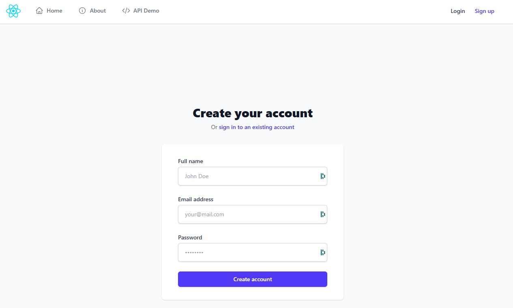

# Spring Boot + React - Fullstack Auth Template

This project is a fullstack web application combining a Spring Boot backend and a React frontend. It demonstrates modern authentication, user management, API integration, and secure file uploads.

## Screenshoot


## Features
- **Spring Boot Backend**
  - JWT authentication (access & refresh tokens)
  - User registration, login, profile update, password change
  - CSRF protection, CORS configuration
  - RESTful API endpoints
  - File upload support
  - MariaDB database integration
  - Detailed logging and debug tools
- **React Frontend**
  - TypeScript + Vite setup
  - Authentication flows (login, register, logout)
  - User profile management
  - Responsive layout with Navbar, Sidebar
  - Custom hooks and shared components
  - Toast notifications

## Project Structure
```
Spring-Boot-React/
├── src/main/java/app/         # Spring Boot backend source
│   ├── config/                # Security, CORS, CSRF configs
│   ├── controller/            # REST API controllers
│   ├── dto/                   # Data transfer objects
│   ├── model/                 # Entity models
│   ├── repository/            # JPA repositories
│   ├── security/              # JWT, filters, etc.
│   ├── service/               # Business logic
│   └── Application.java       # Main entry point
├── src/main/resources/        # Backend resources
│   ├── application.properties # App config
│   └── static/                # Static files
├── react/                     # React frontend
│   ├── src/                   # Frontend source
│   │   ├── app/               # App setup, routing, providers
│   │   ├── features/          # Auth, layout, user features
│   │   ├── pages/             # Main pages
│   │   ├── shared/            # Shared components/hooks/lib
│   │   └── styles/            # CSS
│   ├── public/                # Public assets
│   ├── package.json           # Frontend dependencies
│   └── vite.config.ts         # Vite config
├── logs/                      # Application logs
├── pom.xml                    # Maven config
└── ...                        # Other files
```

## Setup & Run

### Backend (Spring Boot)
1. **Install Java 17+ and Maven**
2. Configure MariaDB (see `application.properties`)
3. Run:
   ```bash
   ./mvnw spring-boot:run
   ```
   or
   ```bash
   java -jar target/app.jar
   ```

### Frontend (React)
1. **Install Node.js (18+) and npm**
2. Navigate to `react/` folder
3. Install dependencies:
   ```bash
   npm install
   ```
4. Start dev server:
   ```bash
   npm run dev
   ```

### Access
- Frontend: [http://localhost:8100](http://localhost:8100)
- Backend API: [http://localhost:8100/api](http://localhost:8100/api)

## Environment Configuration
- Backend config: `src/main/resources/application.properties`
- Frontend config: `react/src/shared/lib/apiClient.ts`

## Testing
- Backend: JUnit tests in `test/java/app/`
- Frontend: Add tests in `react/src/`

## Logging
- Logs are written to `logs/app.log` (configurable)

## Improvements & Style Guide
- See `IMPROVEMENTS.md` and `STYLE_GUIDE.md` for suggestions and coding standards.

## License
This project is for educational/demo purposes. Adapt as needed for production use.
